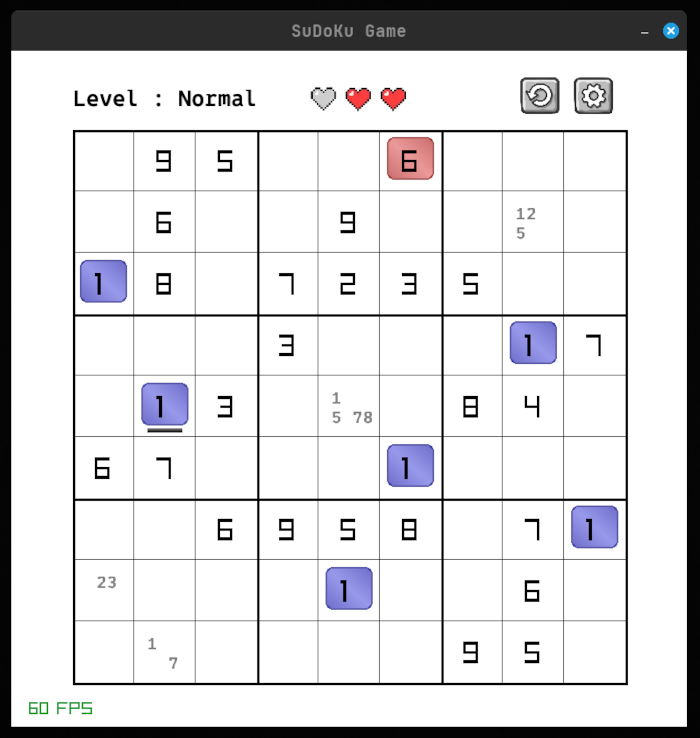

# Zig SuDoKu  

  
  

## About  
Zig SuDoKu is a simple yet engaging Sudoku game built using the Zig programming language (version **0.13**). This project provides a playable Sudoku experience with an intuitive interface.  

## Installation & Usage  

### Prerequisites  
- Install [Zig](https://ziglang.org/) version **0.13**  

### Running the Game  

You can start the game with one of the following commands:  

```sh
zig build run
```
Or build the project first and then run the executable:
```sh
zig build
./zig-out/bin/Zig_SuDoKu
```